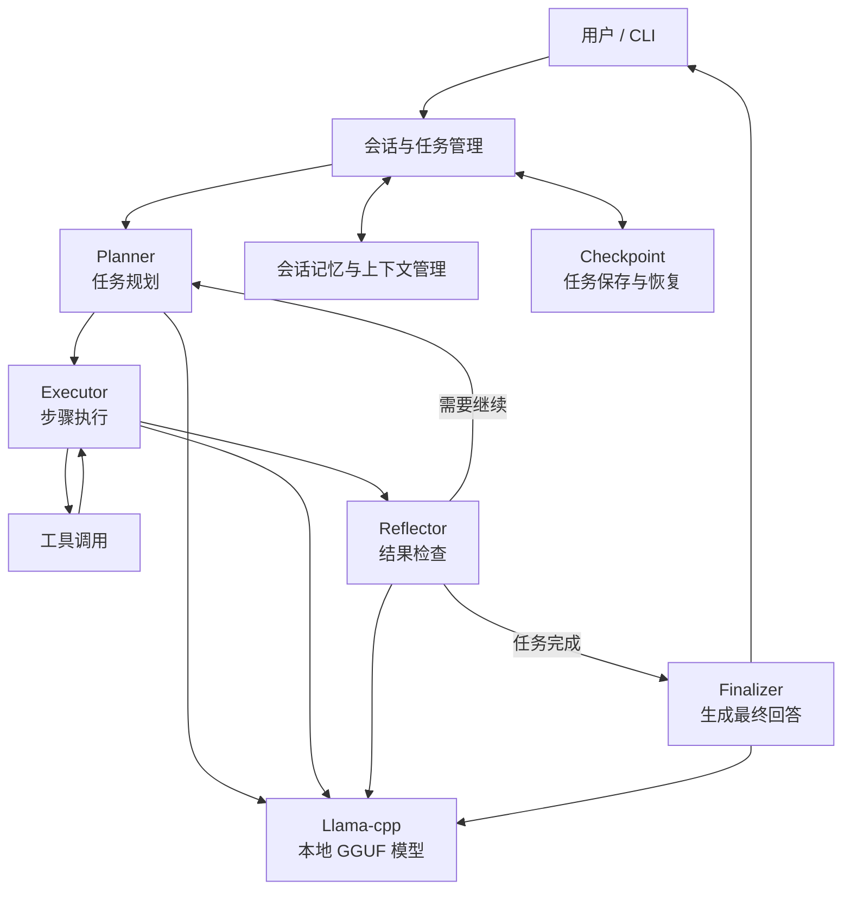
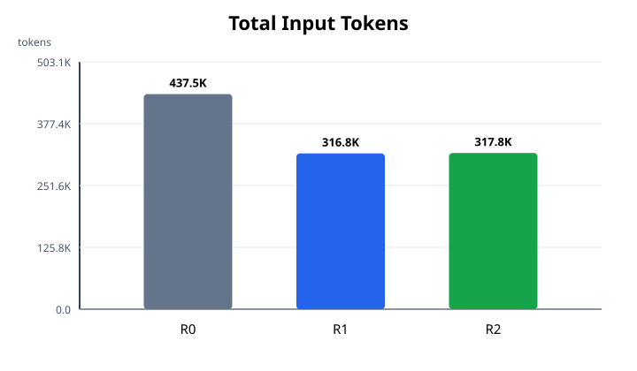
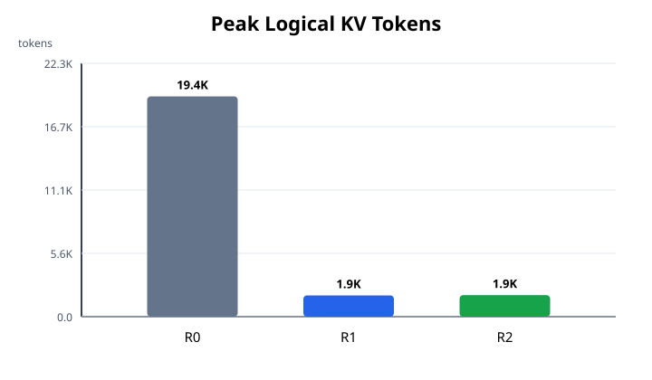
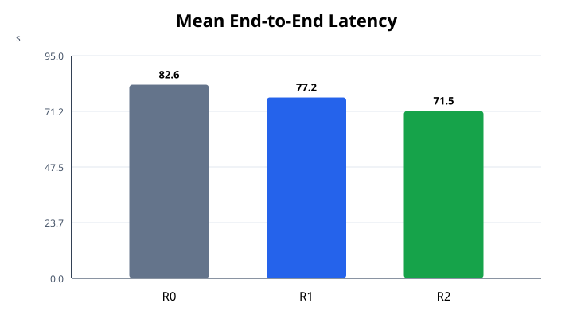
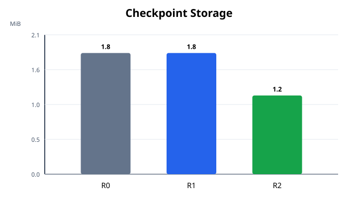
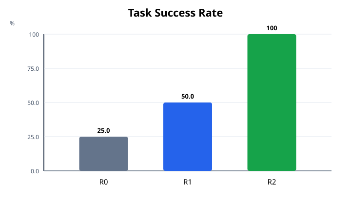

# llama-agent

`llama-agent` 是一个完全本地运行的工具型 Agent 系统。项目使用`llama-cpp-python` 加载 GGUF 模型，通过 LangChain 的 ChatModel/Tool 接口接入模型与工具，并用 LangGraph 实现可 checkpoint、可 resume 的Planner–Executor–Reflector–Finalizer 工作流。

系统支持单任务执行、持久化多轮会话、本地工具调用、全屏交互式 CLI、运行遥测和可重复 Benchmark。在此基础上，项目实现了两项面向长生命周期Agent 的上下文优化：

- **R1：工具输出虚拟化**——大型工具结果外置到 ArtifactStore，模型只接收摘要、首尾预览和按需读取句柄。
- **R2：生命周期上下文管理**——根据上下文的重要性、时效性和访问阶段，选择、压缩或归档历史执行记录与会话轮次。

> 当前 R1/R2 属于 Agent 应用层的上下文优化。它们能够减少输入 Token、Prompt 预填充开销和逻辑 KV 占用，但没有修改 llama.cpp 的物理 KV Cache分配器。

## 目录

- [1. 项目说明](#1-项目说明)
- [2. R0、R1、R2 优化设计](#2-r0r1r2-优化设计)
- [3. Benchmark 设计与测试结果](#3-benchmark-设计与测试结果)
- [4. 安装、配置与使用](#4-安装配置与使用)

## 1. 项目说明

### 1.1 核心能力

- 本地加载 Qwen 等 GGUF 模型，不依赖云端推理 API。
- 使用 `llama-cpp-python` 执行模型推理，可配置 CPU、CUDA 或 Metal offload。
- 通过 LangChain `BaseChatModel` 和 `BaseTool` 接入模型与工具生态。
- 通过 LangGraph 编排 Planner、Executor、Reflector 和 Finalizer。
- 使用 SQLite Checkpointer 保存 AgentState，支持任务中断恢复。
- 使用 ConversationStore 保存多轮对话，可在后续轮次召回历史信息。
- 支持文件、日志、只读 SQLite、受限 Shell、Artifact 和 Skill 工具。
- 提供单次任务、持久化对话、普通交互和全屏 TUI 四种使用方式。
- 采集推理、工具、生命周期、进程内存、GPU 显存和逻辑 KV 指标。
- 在隔离子进程中执行 Benchmark，并自动生成 Markdown 报告和 SVG 图表。

### 1.2 系统架构



外层 LangGraph 负责一个任务的计划、执行、反思与最终回答；Executor 内部还有一个 ReAct 子图，用于完成“决定调用工具 → 执行真实工具 → 将工具结果重新送入模型 → 生成步骤结论”的闭环。
Checkpoint 只保存外层节点边界状态，避免内外两层同时持久化造成恢复语义混乱。

### 1.3 主要模块

```text
.
├── agent_config.toml                 # 运行时配置
├── pyproject.toml                    # Python包、依赖与 CLI 入口
├── benchmark/
│   ├── workloads/                    # R0/R1/R2 测试套件
│   └── results/                      # 原始数据、报告与图表
├── src/agent_core/
│   ├── llm_engine.py                 # 本地 GGUF ChatModel
│   ├── graph/                        # LangGraph 节点、路由与 Checkpoint
│   ├── conversation/                 # 多轮会话管理与 SQLite 持久化
│   ├── capabilities/                 # 工具 Provider 与 Capability 注册
│   ├── artifacts/                    # R1 ArtifactStore 与虚拟化
│   ├── memory/                       # R2 生命周期上下文管理
│   ├── telemetry/                    # Token、KV、RSS、GPU 等遥测
│   ├── benchmark/                    # Runner、Evaluator、聚合与报告
│   ├── interactive/                  # 斜杠命令和交互会话
│   ├── tui/                          # Textual 全屏终端界面
│   └── templates/                    # 各 Agent 节点的 Jinja2 Prompt
└── src/tests/                        # 单元测试与真实模型集成测试
```

### 1.4 当前工具

| 分类 | 工具 | 作用 |
|---|---|---|
| Shell | `execute_shell_command`、`count_lines` | 执行白名单命令、统计代码行数 |
| 文件 | `get_file_metadata`、`read_file`、`search_file` | 查看元数据、分段读取、检索文本 |
| 日志 | `aggregate_log_errors`、`search_log`、`get_log_window` | 错误聚合、关键词检索、上下文窗口 |
| SQLite | `describe_sqlite_table`、`query_sqlite` | 查看表结构、执行只读查询 |
| Artifact | `get_artifact_summary`、`retrieve_artifact`、`search_artifact` | 查看、分段读取或搜索外置结果 |
| Skill | 配置目录中的 Skill | 将本地技能注册为 Agent Capability |

Shell 工具采用命令白名单和强制超时；
SQLite 工具只允许读取；
文件、日志、SQLite 和 Artifact 工具均受到路径或任务所有权隔离。

## 2. R0、R1、R2 优化设计

三轮消融采用递进关系：

| Round | Artifact 虚拟化 | 生命周期上下文 | 用途 |
|:---:|:---:|:---:|---|
| R0 | 关闭 | 关闭 | 功能基线 |
| R1 | 开启 | 关闭 | 验证大型工具输出外置 |
| R2 | 开启 | 开启 | 在 R1 上验证执行状态压缩和长会话召回 |

### 2.1 R0：无上下文优化的功能基线

R0 关闭所有 `[memory]` 优化开关，工具原始结果和基线会话历史直接进入模型上下文。用于验证 Agent 功能是否完整，并作为 R1/R2 的对照组。

完成一次任务的主要流程如下：

1. **Planner** 根据用户目标生成可执行步骤；普通问题也可以生成无工具回答步骤。
2. **Executor** 执行当前步骤。需要外部证据时，内部 ReAct 子图生成结构化`tool_calls`，真实调用 Capability，并将 `ToolMessage` 重新送回模型。
3. **Reflector** 检查计划和真实执行记录，决定任务完成、失败或重新规划。
4. **Finalizer** 根据用户目标、计划和执行证据生成统一 `final_answer`。
5. LangGraph Checkpointer 在节点边界保存状态；进程中断后可以按照 `thread_id`继续执行。

### 2.2 R1：工具输出虚拟化

#### 问题

调用日志、文件或数据库工具可能一次返回几十数百 KiB的数据，若每轮对话都把完整结果写入 ToolMessage、LangGraph State 和后续 Prompt，会同时造成：

- 输入 Token 与 Prefill 时间增加；
- 逻辑 KV Cache 随上下文增长；
- 模型注意力被大量低价值中间数据占用；
- 长结果可能直接超过 `n_ctx`。

#### 设计原理

对模型暴露一个小型逻辑视图，对于工具结果仅保留摘要和部分预览送入模型，原始数据则放在可寻址的外部存储中。模型只有在摘要和预览不足时，才按需搜索或读取原文。

工具结果大小在小于artifact_inline_max_bytes时，将原结果送入模型；当结果大于artifact_inline_max_bytes是，原文写入AtifactStore，只将摘要、头部预览、尾部预览和可用操作送入模型，模型根据需要调用工具查询原文。

```text
工具原始结果
    │
    ├── 大小 <= artifact_inline_max_bytes ──> 原样进入模型
    │
    └── 大小 > artifact_inline_max_bytes
          ├── 原文写入 ArtifactStore
          ├── 生成 SHA-256 与 artifact
          └── 模型只接收摘要、头部预览、尾部预览和可用操作
```

当前摘要是**确定性摘要**，不会额外调用模型。它包含工具名、原始字节数、行数和结构化结果中的小型标量字段；`content`、`stdout`、`rows`、`matches`等字段不会复制到摘要。预览在固定字符预算内平均保留头部和尾部，适合证据分别位于文件开头或结尾的场景。

ArtifactStore 采用混合存储：

- `data/artifacts/artifacts.sqlite` 保存 Artifact 元数据；
- `data/artifacts/content/<id>.bin` 保存原始内容；
- `artifact://<opaque-id>` 作为不暴露文件路径的任务级句柄；
- `owner_id` 防止一个任务读取另一个任务的 Artifact。

模型可通过以下工具恢复必要证据：

- `get_artifact_summary`：读取元数据和摘要；
- `search_artifact`：在完整 Artifact 中检索关键词并返回有限上下文；
- `retrieve_artifact`：按 `offset + length` 分段读取原文。

这项优化不依赖特定模型或推理引擎，也不增加摘要推理调用。它的主要代价是磁盘写入、SQLite 元数据和按需检索调用，因此阈值过低会对小结果产生负优化。

### 2.3 R2：生命周期上下文管理

#### 问题

R1 只处理单次产生的超大工具结果，但 Agent 在长任务和多轮对话中还会不断积累执行记录、工具摘要和历史消息。这些内容即使每条都不大，累计后仍会使 Prompt越来越长，增加输入 Token、预填充时间和 Checkpoint 体积。
如果简单删除旧记录，模型又可能忘记用户要求记住的事实、早期工具证据或任务结论。因此，R2 需要在减少上下文长度和保留有效记忆之间取得平衡。

#### 设计原理

R2 将上下文看作需要持续整理的模块：重要内容和最近使用的内容保留在 Prompt中，较早内容压缩后归档，已经失效或与当前问题无关的内容不再重复发送给模型。

具体处理方式如下：

1. **保留重要内容**：优先保留当前目标、有效计划、用户明确要求记住的内容，以及最近几轮对话和最近几条执行记录。
2. **压缩较早记录**：当执行记录累计超过阈值时，从旧记录中提取结论、错误和关键内容，生成不调用模型的确定性摘要。原文写入 `ContextStore`，Agent 状态只保留摘要和 `memory://` 引用。
3. **按需选择会话历史**：每轮对话只注入明确记忆、最近对话和与当前问题相关的较早对话；用户更正信息时，以新信息覆盖旧信息。
4. **保留完整原始数据**：完整会话仍存储在 `conversations.sqlite`，归档执行记录存储在 `ContextStore`。缩短 Prompt 但不是删除历史。
5. **避免无效压缩**：只有上下文超过激活阈值，并且预计压缩后有明显收益时才执行归档。短任务、小记录和压缩收益不足的记录保持原样。

### 2.4 开关与主要参数

`agent_config.toml` 默认关闭优化，确保普通 R0 测试不会被污染：

```toml
[memory]
# R1
artifact_virtualization = false
artifact_inline_max_bytes = 8192
artifact_preview_chars = 1200
artifact_summary_chars = 600

# R2
lifecycle_context = false
context_store_path = "data/context_memory.sqlite"
context_budget_tokens = 12000
context_activation_tokens = 2048
context_trigger_ratio = 0.75
context_min_compaction_bytes = 2048
context_min_compaction_ratio = 0.30
hot_execution_records = 4
hot_conversation_turns = 4
summary_trigger_tokens = 6000
summary_target_chars = 800
context_retrieval_top_k = 3
context_retrieval_token_budget = 2000
checkpoint_compaction = true
```

也可以用环境变量临时覆盖：

```bash
# R1
export AGENT_MEMORY_ARTIFACT_VIRTUALIZATION=true
export AGENT_MEMORY_LIFECYCLE_CONTEXT=false

# R2（R2 必须同时启用 R1）
export AGENT_MEMORY_ARTIFACT_VIRTUALIZATION=true
export AGENT_MEMORY_LIFECYCLE_CONTEXT=true
```

## 3. Benchmark 设计与测试结果

### 3.1 实验方法

Benchmark 采用以下方法减少不可控因素：

- Fixture 全部在本地确定性生成，不依赖网络。
- 每个样本在新的 Python 子进程中加载模型，隔离 llama.cpp 分配器、KV 状态、Checkpoint、ConversationStore、ArtifactStore 和 ContextStore。
- 同一 Suite 的 R0/R1/R2 使用相同模型文件、模型 SHA-256、采样种子、Fixture、任务和评价规则。
- `suite.seed + repetition` 作为每次重复的模型随机种子。
- Warmup 样本单独执行，但不计入正式汇总。
- 自动保存原始 JSONL/CSV、失败详情、聚合结果、Markdown 报告与 SVG 图表。

单个运行目录包含：

```text
manifest.json
task_results.jsonl
inference_events.jsonl
tool_events.jsonl
lifecycle_events.jsonl
system_memory.csv
kv_metrics.csv
summary.json
failures.jsonl
report.md
```

### 3.2 用例设计

| Suite | 用例 | 主要验证目标 |
|---|---|---|
| `r0_smoke.json` | 小规模文件、工具和会话任务 | 安装与主链路冒烟 |
| `r0_full.json` | W1～W8，共 9 个 Case | 文件、日志、SQLite、大输出、多工具、恢复和多轮记忆 |
| `r1_artifact_virtualization.json` | 16 KiB、64 KiB、256 KiB | R1 预览与按需 Artifact 检索 |
| `r2_context_pressure.json` | 6 × 6000 B 工具结果 | 单结果低于 R1 阈值、累计上下文触发 R2 |
| `r2_lifecycle_context.json` | 16/32 轮召回、多阶段证据、Artifact 回归 | R2 会话召回和 R1 兼容性 |

`r0_full.json` 的 W1～W8：

- **W1 文件检查**：先读取元数据，再读取文件内容。
- **W2 SQLite 调查**：查看表结构，再执行只读查询。
- **W3 日志分析**：错误聚合、关键词搜索、上下文窗口三步链路。
- **W4 大文件**：分别读取 16 KiB 和 64 KiB，并识别尾部证据。
- **W5 多工具故障调查**：联合日志、SQLite 和配置文件形成证据链。
- **W6 失败恢复**：先验证写操作被拒绝，再执行只读查询。
- **W7 八轮记忆**：验证事实保存、端口更新和综合召回。
- **W8 工具证据跨轮使用**：后续轮次不得重复调用工具。

### 3.3 当前 R0～R2 对比结果

以下数据来自仓库中保留的三次自动消融测试。三次测试使用相同模型文件。
以下结果的实验平台为：
> CPU: 12 vCPU Intel(R) Xeon(R) Platinum 8352V CPU @ 2.10GHz
> GPU: NVIDIA vGPU-32GB
> 内存: 90G
> 镜像: PyTorch  2.8.0 CUDA 12.8 
> 模型: Qwen3VL-8B-Instruct-Q8_0.gguf


#### 实验 A：通用功能与 R1 大输出优化

数据源：
包含 9 个 Case、1 次 Warmup、5 次正式重复，共 45 个正式样本/轮。

| 指标 | R0 | R1 | R2 |
|---|---:|---:|---:|
| 任务成功率 | 97.78% | 97.78% | 97.78% |
| 平均端到端耗时 | 28.81 s | 27.51 s | 28.18 s |
| P95 端到端耗时 | 39.90 s | 42.63 s | 39.33 s |
| 累计输入 Token | 437,509 | 316,819 | 317,757 |
| 峰值逻辑 KV Token | 19,353 | 1,867 | 1,889 |
| 峰值 GPU 进程显存 | 12,768 MiB | 12,232 MiB | 12,232 MiB |
| Checkpoint 总量 | 10.31 MiB | 8.00 MiB | 8.10 MiB |





R1 相对 R0：

- 成功率保持不变；
- 输入 Token 减少 **27.59%**；
- 峰值逻辑 KV Token 减少 **90.35%**；
- GPU 进程显存峰值减少 **4.20%**；
- Checkpoint 总量减少 **22.42%**；
- 平均端到端耗时减少 **4.51%**。

R1 共虚拟化 10 个大型结果，外置原文 418,490 B，减少模型内联400,155 B，工具结果压缩率为 95.62%。收益主要来自 16/64 KiB 两个 W4 Case；其中 64 KiB Case 的输入 Token/样本从 21,572 降至 3,960，平均耗时从30.93 s 降至 15.74 s。

#### 实验 B：R2 累计执行上下文压力
本轮测试连续读取 6 个 6000 B 文件

| 指标 | R0 | R1 | R2 |
|---|---:|---:|---:|
| 任务成功率 | 100.00% | 100.00% | 100.00% |
| 平均端到端耗时 | 82.60 s | 77.19 s | 71.46 s |
| P95 端到端耗时 | 84.53 s | 80.34 s | 73.15 s |
| 累计输入 Token | 174,647 | 174,654 | 161,202 |
| 峰值逻辑 KV Token | 9,686 | 9,686 | 7,999 |
| 峰值 GPU 进程显存 | 12,472 MiB | 12,472 MiB | 12,424 MiB |
| Checkpoint 总量 | 1.80 MiB | 1.80 MiB | 1.17 MiB |





R2 相对 R1：

- 成功率保持 100%；
- 输入 Token 减少 **7.70%**；
- 峰值逻辑 KV Token 减少 **17.42%**；
- Checkpoint 总量减少 **35.06%**；
- 平均端到端耗时减少 **7.43%**。

#### 实验 C：R2 长会话生命周期

数据源：
本轮测试包含 16 轮召回、32 轮召回、多阶段本地证据和 Artifact 中部证据回归，每轮共 20 个正式样本。

| 指标 | R0 | R1 | R2 |
|---|---:|---:|---:|
| 任务成功率 | 25.00% | 50.00% | 100.00% |
| 平均端到端耗时 | 99.14 s | 91.46 s | 74.80 s |
| P95 端到端耗时 | 189.50 s | 192.10 s | 140.94 s |
| 累计输入 Token | 635,905 | 467,285 | 419,456 |
| 峰值逻辑 KV Token | 19,566 | 2,474 | 2,425 |
| 峰值 GPU 进程显存 | 12,784 MiB | 12,248 MiB | 12,248 MiB |
| Checkpoint 总量 | 38.04 MiB | 19.07 MiB | 19.08 MiB |




R0/R1 的会话基线只保留最近 8 轮，无法在 16/32 轮后看到最早的`AgentMem/7319`，两类召回 Case 均为 0/5，因此R0，R1执行成功率低于R2。

R2 相对 R1 的输入 Token 减少 **10.24%**，平均端到端耗时减少 **18.21%**。生命周期遥测显示会话上下文投影压缩率为 41.50%，额外召回 450 个历史轮次记录，最终选择 1,050 个轮次记录，共注入 49,130 Token。

#### 结果结论

1. **R1 已在大工具输出场景形成稳定收益**：成功率不下降，同时明显减少输入Token、逻辑 KV、Checkpoint 和 64 KiB Case 延迟。
2. **R2 必须在达到上下文压力或历史超出最近窗口时评估**：短任务不触发是自适应策略的预期行为。
3. **R2 执行状态压缩有效**：长对话任务中 Token、逻辑 KV、Checkpoint 和延迟均下降。

### 3.4 执行 Benchmark

运行单轮：

```bash
llama-agent --config agent_config.toml benchmark \
  --suite benchmark/workloads/r0_full.json \
  --output-root benchmark/results \
  --round R0/R1/R2
```

只执行指定 Case，`--case` 可以重复：

```bash
llama-agent --config agent_config.toml benchmark \
  --suite benchmark/workloads/r0_full.json \
  --output-root benchmark/results \
  --round R0-regression \
  --case w4-large-file-16k \
  --case w4-large-file-64k
```

也可以使用脚本：

```bash
python src/agent_core/benchmark/run_r0_r2_ablation.py \
  --config agent_config.toml \
  --suite benchmark/workloads/r0_full.json \
  --output-root benchmark/results
```

## 4. 安装、配置与使用

### 4.1 环境要求

- Python 3.11 或更高版本；
- C/C++ 编译器、CMake；
- 一个 GGUF 格式的权重文件；
- 使用 NVIDIA GPU 时，需要可用的驱动、CUDA Toolkit 和 `nvcc`；

### 4.2 CPU 安装

最简单的 CPU 安装：

```bash
python -m venv .venv
source .venv/bin/activate
python -m pip install --upgrade pip setuptools wheel
python -m pip install -e .
```
CPU 配置中设置：
```toml
[engine]
n_gpu_layers = 0
```

### 4.3 NVIDIA CUDA 安装

先确认驱动和编译器：

```bash
nvidia-smi
nvcc --version
```


建议在全新虚拟环境中先构建 CUDA 版 `llama-cpp-python`，再安装项目：

```bash
python3.11 -m venv .venv
source .venv/bin/activate
python -m pip install --upgrade pip setuptools wheel

CMAKE_ARGS="-DGGML_CUDA=ON" \
FORCE_CMAKE=1 \
CUDACXX=/usr/local/cuda/bin/nvcc \
python -m pip install --no-cache-dir \
  llama-cpp-python==0.3.19

python -m pip install -e ".[gpu]"
```


输出应为 `True`。然后配置：

```toml
[engine]
n_gpu_layers = -1
```

Apple Silicon 可将构建参数替换为：

```bash
CMAKE_ARGS="-DGGML_METAL=ON" FORCE_CMAKE=1 \
python -m pip install --no-cache-dir --force-reinstall \
  llama-cpp-python==0.3.19
```

### 4.4 `pyproject.toml` 与运行配置

`pyproject.toml` 负责 Python 包元数据、依赖和命令入口。

开发环境可安装：

```bash
python -m pip install -e ".[dev]"
```

模型与运行时参数配置在 `agent_config.toml`：

```toml
[agent]
max_iterations = 6
db_path = "data/checkpoints.sqlite"
conversation_db_path = "data/conversations.sqlite"
conversation_history_turns = 8
conversation_history_token_budget = 4096

[engine]
model_path = "/root/models/model.gguf"
n_ctx = 20000
n_gpu_layers = -1       # CPU 使用 0
n_batch = 512
n_threads = 8
chat_format = "chatml-function-calling"
temperature = 0.2
max_tokens = 512
disable_thinking = true
```

### 4.5 单次任务与工具调用

普通对话：

```bash
llama-agent --config agent_config.toml run "你好"
```

显式要求 Agent 调用工具：

```bash
llama-agent --config agent_config.toml run \
  "使用 count_lines 统计 src/agent_core/llm_engine.py 的行数"

llama-agent --config agent_config.toml run \
  "先用 get_file_metadata 查看 README.md，再用 read_file 读取前 2000 个字符并总结"
```

任务被中断后恢复：

```bash
llama-agent --config agent_config.toml resume <thread_id>

# 省略 thread_id 时恢复最近任务
llama-agent --config agent_config.toml resume
```

### 4.6 持久化多轮会话

每次执行 `continue` 会复用最近的 `conversation_id`：

```bash
llama-agent --config agent_config.toml continue \
  "记住项目代号是 AgentMem，部署环境是 linux"

llama-agent --config agent_config.toml continue \
  "上一轮的项目代号和部署环境是什么？"
```

也可以指定会话：

```bash
llama-agent --config agent_config.toml continue \
  --conversation-id <conversation_id> \
  "继续分析上一轮结果"

llama-agent --config agent_config.toml list-conversations
```

### 4.7 交互式终端

普通 stdin 交互：

```bash
llama-agent --config agent_config.toml chat
```

全屏 TUI：

```bash
llama-agent --config agent_config.toml cli
llama-agent --config agent_config.toml cli --show-thinking
llama-agent --config agent_config.toml cli --conversation-id <conversation_id>
```

等待模型时界面显示动态省略号；任务完成后一次性显示回答。右侧状态区展示会话、模型配置、Token、逻辑 KV、RSS 和 GPU 显存等信息。

常用斜杠命令：

```text
/help
/quit
/new
/resume <conversation_id>
/history
/conversations
/tools
/skills
/tool <name> <request>
/skill <name> <request>
/<capability> <request>
/thinking on|off
/stats
/config
/clear
```

例如：

```text
/count_lines 统计 src/agent_core/llm_engine.py 的行数
/tool search_log 在 benchmark.log 中搜索 ERROR
```

这些命令只约束本轮必须使用指定 Capability。

`tui.show_thinking` 或 `--show-thinking` 只控制是否展示模型返回的原始思考内容；只有 `engine.disable_thinking = false` 时，支持 Thinking 的模型才通常会生成该内容。

### 4.8 测试

运行单元测试：

```bash
python -m pytest src/tests
```

只运行 R1/R2 相关测试：

```bash
python -m pytest \
  src/tests/test_r1_artifact_virtualization.py \
  src/tests/test_r2_lifecycle_context.py \
  src/tests/test_benchmark_ablation.py
```
